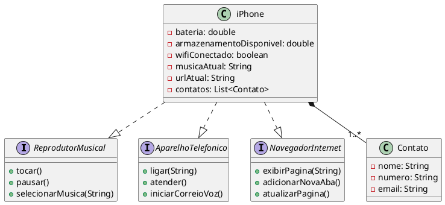

# 📱 Modelagem e Diagramação – Componente iPhone

Este projeto apresenta a **modelagem UML** do componente **iPhone**, inspirado na apresentação de 2007 em que Steve Jobs descreveu o dispositivo como **três produtos em um**:  
um reprodutor musical, um telefone e um navegador de Internet.  
Aqui, ampliamos o modelo para incluir também uma **lista de contatos**.

---

## 🎯 **Objetivo**

Demonstrar o uso de **interfaces**, **abstração** e **composição** em um modelo orientado a objetos.  
O diagrama apresenta o **iPhone** como uma classe que implementa três funcionalidades principais e mantém uma lista de contatos.

---

## 🧩 **Principais Elementos do Modelo**

### Interfaces
- 🎵 **ReprodutorMusical** — métodos: `tocar()`, `pausar()`, `selecionarMusica(String)`  
- ☎️ **AparelhoTelefonico** — métodos: `ligar(String)`, `atender()`, `iniciarCorreioVoz()`  
- 🌐 **NavegadorInternet** — métodos: `exibirPagina(String)`, `adicionarNovaAba()`, `atualizarPagina()`

## 🧱 **Diagrama UML (PlantUML)**

Use um renderizador PlantUML, como:
- [PlantText](https://www.planttext.com/)  
- [PlantUML Editor Online](https://plantuml-editor.kkeisuke.app/)  
- Extensão **PlantUML** no VSCode  

---

## 🧠 **Conceitos de POO aplicados**

- **Abstração**: definição de contratos por interfaces.  
- **Encapsulamento**: controle de atributos e comportamento interno.  
- **Polimorfismo**: implementação de múltiplas interfaces por uma única classe.  
- **Composição**: o `iPhone` contém e gerencia seus próprios contatos.  

---

## 🧾 **Créditos**

Desenvolvido como parte de um exercício da plataforme **DIO**.  
Inspirado no vídeo de lançamento do iPhone (2007).
